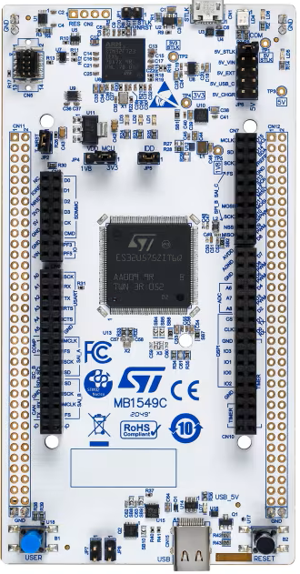

# nucleo-u575 �?STM32U575ZIT6 development projects

Bare-metal projects for the **nucleo-u575** board (NUCLEO-U575ZI-Q,
**STM32U575ZIT6**), built with **CMake/Ninja** (Pico-style), debugged/flashed
through an **ST-Link** over **SWD**, with `printf()` streamed out **USART1
(PA9/PA10)** at **115200 baud** �?the ST-Link's **virtual COM port (VCP)** is
the console.



## Board facts

- MCU: **STM32U575ZIT6** (Cortex-M33 @ up to 160 MHz, 2 MB flash, 768 KB SRAM)
- Clock: **MSI 4 MHz** �?PLL (M=1, N=80, R=2) �?**160 MHz** (no external crystal required)
- Regulator: **VOS1** on the **SMPS** supply (the NUCLEO default); flash latency 4 WS
- Cache: **ICACHE** enabled (1-way) �?at 160 MHz the core outruns flash
- LEDs (all **high-active**): **LD1 green PC7**, **LD2 blue PB7**, **LD3 red PG2**
- User button: **B1 PC13**, momentary, **active-low** (`BTN_PRESSED()` = pin == 0)
- Console: **USART1** on **PA9 (TX) / PA10 (RX)**, AF7, **115200 8-N-1** �?ST-Link VCP
- SWO: **PB3** (AF0) �?DWT/ITM enabled, but the UART VCP is the console
- Debug: **ST-Link** (V2/V3) over SWD; probe-rs chip name `STM32U575ZI`, auto-detected

## Projects (`bare/`)

| Project              | What it does |
| -------------------- | ------------ |
| `bare/blink_hello`   | Blinks the LEDs and periodically samples the **ADC1 internal channels** (VREFINT / temperature sensor / VBAT) and prints them |
| `bare/dhry_160m`     | Dhrystone 2.1, 10,000,000 runs, GCC or armclang, `-Ofast -ffp-contract=fast -funroll-loops` |
| `bare/coremark_160m` | CoreMark 1.0.1, 10,000 iterations, GCC / armclang / starm-clang, `-Ofast`-class flags |
| `bare/st7789s_md120_240x240_ft6336` | **ST7789S 1.2" 240x240** LCD (**TK012F6** module, 3-wire 9-bit serial, no D/C pin) via **HW SPI1** + **FT6336** capacitive touch over **HW I2C1**; pattern set, FPS counter, touch printout |
| `bare/nv3030b_md183_240x284_cst816d` | **NV3030B 1.83" 240x284** LCM (**TK018F3716** module, wrapped-command SPI: CS frame with `02 00 <cmd> 00` header, vendor-verbatim registers) via **HW SPI1** (CS=PA4 SCK=PA5 MOSI=PA7, write-only) + **CST816D** touch over **HW I2C1**; SOFT/HW bus passes, pattern set, FPS counter, touch printout (ported from the ch32v307 reference; OCTOSPI path dropped - HAL transmit was byte-at-a-time, ~8 M CPU ops per fill) |
| `bare/co5300_md196_368x448_chsc6417` | **CO5300 1.96" 368x448** LCM (**TK0196M106** module, same wrapped-command SPI bus) via **HW SPI1** (CS=PA4 SCK=PA5 MOSI=PA7, write-only; brightness over SPI 51h) + **CHSC6417** touch over **HW I2C1** (addr 0x2E, data reg 0x00); SOFT/HW bus passes, asset bring-up, pattern set, FPS counter (vendor: TK499 single-lane + ESP32 QSPI examples) |

All projects share the board support in `board/` (160 MHz clock from the MSI,
PC7/PB7/PG2 LEDs, PC13 button, USART1 console, newlib stubs, ST HAL wiring)
and the CMake helpers in `cmake/`.

> �?**Do not use LTO for Dhrystone.** GCC `-flto` hoists loop-invariant work
> out of the timed region and inflates the score (still passing the checks).
> See `bare/dhry_160m/LTO_on_dhrystone.md`.

## Power domains & analog supplies

Several supplies are **independent of VDD and off by default**, and two of them
are easy to miss on this part:

- **VDDA must be enabled** �?`HAL_PWREx_EnableVddA()` in `HAL_MspInit()`
  (`board/stm32u5xx_hal_msp.c`). Without it the ADC analog block stays
  unpowered: its internal regulator never becomes ready (LDORDY never sets),
  `ADC_Enable()` times out and calibration hangs in `Error_Handler`. VDDA also
  feeds the DAC/comparators/OPAMP.
- **VDDIO2 must be enabled** �?`HAL_PWREx_EnableVddIO2()`, also in
  `HAL_MspInit()`. It powers the **PG[15:2]** I/Os, so anything on PORTG needs
  it. On this board **LD3 (red) is PG2**, so without it the LED never lights
  even though the pin is configured as an output.

A third, ADC-specific point:

- **The ADC kernel clock must actually run** �?the ADC takes **HSI** (16 MHz,
  async) as its clock, so `SystemClock_Config()` turns HSI on even though the
  CPU runs from MSI→PLL.

Also note the `stm32u5xx_ll_adc.h` factory calibration constants are **14-bit**
while a project may run the ADC at 12 bits; use the official
`__LL_ADC_CALC_*` macros instead of open-coding the conversion.

## Clock tree (160 MHz)

```
MSI 4 MHz �?PLL (M=1, N=80, R=2) �?SYSCLK 160 MHz
  AHB=160, APB1=160, APB2=160, APB3=160, flash latency 4, VOS1 + SMPS
```

## SRAM

The linker script uses one contiguous **768 KB** region for data + stack
(SRAM1 + SRAM2 + SRAM3 are contiguous on the U575); SRAM4 is a separate
16 KB low-power domain that these projects do not use.

| Region | Base         | Size   | Use |
| ------ | ------------ | ------ | --- |
| SRAM1  | `0x20000000` | 192 KB | available |
| SRAM2  | `0x20030000` | 64 KB  | available |
| SRAM3  | `0x20040000` | 512 KB | available |
| RAM (contiguous SRAM1+2+3) | `0x20000000` | 768 KB | **main data + stack** (default `.data`/`.bss`/heap/stack) |
| SRAM4  | `0x28000000` | 16 KB  | low-power domain, unused |

## Build / flash / serial console

```bash
cd bare/blink_hello && bash build.sh       # or: cmake -G Ninja -S . -B build && ninja -C build
ninja -C build flash                       # probe-rs download + reset over ST-Link SWD (auto-detected)
ninja -C build flash-reset                 # same, but connect under reset (see Troubleshooting)
```

Or flash with OpenOCD: `ninja -C build flash-ocd`.

To pin a specific ST-Link, pass `-DDEBUG_PROBE=<selector>` at configure time
(see `probe-rs list` for the selector, e.g. `0483:3752:xxxx`). To run SWD at a
lower clock (long or noisy wiring), pass `-DDEBUG_SPEED=<kHz>`.

Read the console on the **ST-Link virtual COM port** (the ST-Link VCP shows up
as a `COMxx`): **115200 baud, 8-N-1**.

## Troubleshooting flashing

### `Target voltage (VAPP) is 0.00 V. Is your target device powered?` + `JtagGetIdcodeError`

The probe is detected but the ST-Link reads the **target supply as 0 V**, so it
cannot drive SWD. This is a **board power** problem, not firmware/tooling �?no
build or `probe-rs` option can work around it. On a NUCLEO-144 board check, in
order (jumper names below follow the NUCLEO-144 layout �?confirm against the
board's user manual):

1. **IDD / power jumper fitted.** The `IDD` jumper (2-pin, `JP5` on
   NUCLEO-144) connects the ST-Link's 3V3 to the MCU `VDD`. It must be **fitted**
   for normal use �?it is only removed to measure current. This is the most
   common cause.
2. **VDD source jumper correct.** The `VDD`/`VDD_MCU` selector (3-pin `JP6` on
   NUCLEO-144) must select **3V3 from the ST-Link** (default). If it is set to
   `E5V`/`VIN`/`AREF` with nothing connected there, the MCU is unpowered.
3. **Power LED lit.** The red `PWR`/`LD4` LED must be on. If it is dark, the
   board is not powered.
4. **Cable in the right port, data-capable.** The cable must be in the
   **ST-Link USB** connector (`CN1`), not the USB-OTG connector. (If the probe
   *were* not detected at all, suspect the cable/port instead.)
5. **Reset the MCU / probe.** Press `B2` (reset), unplug/replug the ST-Link USB,
   and try another USB port (a powered hub can supply too little current).

Confirm from the host side with `probe-rs list` (probe present?) and
`probe-rs info --protocol swd` (does it still report `VAPP ... 0.00 V`?).

### Connect problems that *are* fixable from here

If the probe reports a sane voltage but still will not connect (e.g. the
firmware remaps the SWD pins, enters STOP/STANDBY, or the chip is wedged), use:

```bash
ninja -C build flash-reset      # probe-rs --connect-under-reset: halts the core at reset
```

OpenOCD is the equivalent fallback: add `reset_config srst_only` plus
`reset halt` before `program` in `cmake/openocd_stm32u575.cfg` (or on the
`openocd` command line), and use `ninja -C build flash-ocd`.
